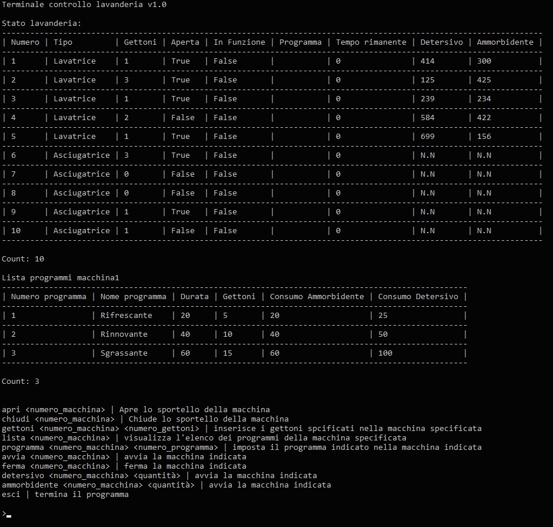

# Csharp-lavanderia

## Obbiettivo
Realizzare un programma console in c# per la verifica remota del funzionamento delle lavatrici e delle asciugatrici presenti in una lavanderia self-service.

## Descrizione generale
La lavanderia possiede 3 lavatrici e 2 asciugatrici.
Le lavatrici hanno due serbatoi integrati, uno di detersivo e uno di ammorbidente.
Il serbatoio di detersivo ha una capacità di 1000ml mentre quello dell’ammorbidente di 500ml. 

### Programmi delle lavatrici
| Numero | Nome | Durata (minuti) | Gettoni | Consumo ammorbidente (ml) | Consumo detersivo (ml) |
| --- | --- | --- | --- | --- | --- |
| 1 | Rinfrescante | 20 | 5 | 20 | 25 |
| 2 | Rinnovante | 40 | 10 | 40 | 50 |
| 3 | Sgrassante | 60 | 15 | 60 | 100 |

### Programmi delle asciugatrici
| Numero | Nome | Durata (minuti) | Gettoni |
| --- | --- | --- | --- |
| 1 | Rapido | 20 | 2 |
| 2 | Intenso | 60 | 4 |

L’utente può agire tramite il programma per effettuare le seguenti verifiche:
- Aprire lo sportello
- Chiudere lo sportello
- Inserire i gettoni
- Chiedere la lista dei programmi
- Selezionare un programma
- Avviare il programma selezionato
- Fermare il programma in esecuzione
- Ricaricare detersivo e ammorbidente

Se una di queste operazioni non è logicamente possibile, il programma dovrà mandare un messaggio all’utente per evidenziare la problematica. 

## Linee guida e vincoli
Per la realizzazione si implementi il codice utilizzando il paradigma ad oggetti e identificando, se necessario, classi astratte ed eredità. Non è necessario l’utilizzo di interfacce.

Per l’interazione con l’utente si implementi il seguente comportamento nel `program.cs`:

Finché l’utente non decide di uscire:
- Stampa lo stato delle macchine in formato tabellare
- Mostra un messaggio informativo dell’ultima operazione effettuata. Questo messaggio può contenere sia gli errori che le operazioni andate a buon fine
- Mostra la lista dei comandi
- Attende l’inserimento del comando all’utente

### Lista comandi
| Comando | Descrizione | Parametro aggiuntivo |
| --- | --- | --- |
| apri | apre lo sportello | - |
| chiudi | chiude lo sportello | - |
| gettoni | inserisce il numero di gettoni nella macchina specificata | numero di gettoni. positivo e maggiore di 0 |
| lista | fornisce la lista dei programmi | - |
| programma    | seleziona il programma specificato sulla macchina indicata | numero del programma        |
| avvia        | avvia il lavaggio o l’asciugatura sulla macchina specificata |                             |
| ferma        | ferma il lavaggio o l’asciugatura sulla macchina specificata |                             |
| detersivo    | ricarica il detersivo sulla macchina specificata         | quantità di detersivo       |
| ammorbidente | ricarica l'ammorbidente sulla macchina specificata       | quantità di ammorbidente    |

Aggiungere anche un comando Esci per terminare il ciclo di esecuzione e uscire dal programma.

Come si evince dall schermata sottostante, all’avvio del programma si consideri:
- uno stato casuale per l’apertura o la chiusura dello sportello
- uno stato casuale per il numero di gettoni inseriti tra 0 e 15 gettoni
- uno stato casuale per il detersivo e l’ammorbidente e del detersivo tra 0 e il massimo consentito per lo specifico serbatoio

## Anteprima Terminale

*Attenzione perché questa immagine mostra due tabelle, la prima è lo stato generale, la seconda è il risultato del comando lista 1. per ottenere questo risultato, se si sono rispettate le richieste, la tabella deve essere inserita in formato stringa all’interno dello spazio dedicato al messaggioUtente.*

Per la visualizzazione tabellare si utilizzi il pacchetto ConsoleTable:
`dotnet add package ConsoleTables --version 2.4.2`

[https://github.com/khalidabuhakmeh/ConsoleTables](https://github.com/khalidabuhakmeh/ConsoleTables)

### BONUS (implementato in branch simulazione)
per rendere il sistema un pò più realistico si gestisca una simulazione del tempo che passa con il seguente comportamento.

1. Richiedere l’input all’utente con il Console.ReadKey();
2. Inserire un Thread.Sleep(1000) che simuli lo scorrere del tempo.
3. Ad ogni ciclo, richiamare una funzione lavanderia.Simulazione() che per ogni macchina in funzione tolga 1 minuto al tempo rimanente per quel lavaggio
4. Quando la macchina termina il tempo semplicemente non è più in funzione
